# Flow / progressive bridge SMC: completed-primary analysis after user-directed stop

Primary analysis completed 2026-09-16T15:53:32.716955+00:00. Protocol identity: `a1070d62c99aa323a9200e2c079b0d87e920f4c40ba5ce353ad26f2fc63d7777`.

This report distinguishes fresh computational reproduction, predictive quality, particle accuracy, reference correspondence and lag reliability. All **30 primary flow fits were retrained** from copied inputs; none reused an old flow checkpoint. All three generator seeds contribute equally. The published SBTG hybrid manuscript matrices are the frozen comparator. This study reuses existing recordings and does not establish independent biological replication.

## User-directed stopping scope

On 16 September 2026, the user requested stopping further computation and analyzing completed data. All 30 primary fits, 260 sampling/comparison archives, 1,440 diagnostic runs and 30 predictive evaluations were completed. The longer-training sensitivity was stopped after 9/15 fits and 34/60 sampling archives. Those partial extended matrices are excluded from the primary ensemble; robustness to longer training remains unresolved. This report completes the revised primary-analysis scope, not the full originally planned extension. See amendments/002_user_stop_20260916T152247Z/AMENDMENT.md.

## Training and convergence

| cohort       |   seed |   fold |   best_epoch |   stopped_epoch | epoch_cap_reached   | extension_required   |   energy |   train_seconds |
|:-------------|-------:|-------:|-------------:|----------------:|:--------------------|:---------------------|---------:|----------------:|
| historical80 |   1701 |      0 |           61 |              81 | False               | False                |   1.5336 |         33.2609 |
| historical80 |   1701 |      1 |           58 |              78 | False               | False                |   1.3360 |         31.5925 |
| historical80 |   1701 |      2 |           59 |              79 | False               | False                |   1.4448 |         31.9972 |
| historical80 |   1701 |      3 |           52 |              72 | False               | False                |   1.5363 |         29.4291 |
| historical80 |   1701 |      4 |           65 |              85 | False               | False                |   1.5168 |         34.3152 |
| historical80 |   2903 |      0 |           58 |              78 | False               | False                |   1.5371 |         31.3743 |
| historical80 |   2903 |      1 |           67 |              87 | False               | False                |   1.3458 |         34.6740 |
| historical80 |   2903 |      2 |           61 |              81 | False               | False                |   1.4442 |         26.7039 |
| historical80 |   2903 |      3 |           56 |              76 | False               | False                |   1.5448 |         25.4989 |
| historical80 |   2903 |      4 |           64 |              84 | False               | False                |   1.5179 |         28.9536 |
| historical80 |   4307 |      0 |           72 |              92 | False               | False                |   1.5450 |         30.0102 |
| historical80 |   4307 |      1 |           64 |              84 | False               | False                |   1.3421 |         28.0742 |
| historical80 |   4307 |      2 |           73 |              93 | False               | False                |   1.4528 |         30.9036 |
| historical80 |   4307 |      3 |           66 |              86 | False               | False                |   1.5498 |         29.7485 |
| historical80 |   4307 |      4 |           70 |              90 | False               | False                |   1.5119 |         31.0371 |
| clean54      |   1701 |      0 |           48 |              49 | True                | True                 |   0.9967 |        104.6568 |
| clean54      |   1701 |      1 |           46 |              49 | True                | True                 |   1.0367 |        114.0063 |
| clean54      |   1701 |      2 |           49 |              49 | True                | True                 |   0.9771 |        124.6990 |
| clean54      |   1701 |      3 |           49 |              49 | True                | True                 |   1.0332 |        124.5395 |
| clean54      |   1701 |      4 |           49 |              49 | True                | True                 |   1.0733 |        115.4458 |
| clean54      |   2903 |      0 |           49 |              49 | True                | True                 |   1.0005 |        104.1178 |
| clean54      |   2903 |      1 |           49 |              49 | True                | True                 |   1.0413 |        113.7954 |
| clean54      |   2903 |      2 |           49 |              49 | True                | True                 |   0.9900 |        124.6023 |
| clean54      |   2903 |      3 |           47 |              49 | True                | True                 |   1.0432 |        124.6041 |
| clean54      |   2903 |      4 |           49 |              49 | True                | True                 |   1.0731 |        115.1634 |
| clean54      |   4307 |      0 |           49 |              49 | True                | True                 |   0.9910 |        104.2988 |
| clean54      |   4307 |      1 |           49 |              49 | True                | True                 |   1.0445 |        113.8584 |
| clean54      |   4307 |      2 |           49 |              49 | True                | True                 |   0.9789 |        124.4558 |
| clean54      |   4307 |      3 |           49 |              49 | True                | True                 |   1.0401 |        129.4765 |
| clean54      |   4307 |      4 |           49 |              49 | True                | True                 |   1.0773 |        119.8108 |

All 15 clean-cohort primary fits triggered the planned longer-training sensitivity. It is incomplete following the user-directed stop; the preserved inventory is in `analysis_stopped_20260916/stop_scope.json`. Early stopping and finite loss are implementation checks, not evidence that the learned law is correct.

## Independent validation

The copied source suite passed 309 tests with two recorded skips. The independent Gaussian precision oracle passed its prespecified bias and particle-improvement gates at lags 0/1/4/16; the standalone replication tests validate orientation, exact joint sign inference, source bootstrap, normalization and direct sampling against the oracle. The complete logs and receipts are under `validation/`.

The historical training cache matches released prepared traces after exact neuron-name reordering and float32 conversion, including missingness. The corrected head-only cohort is 17 recordings and 54 classes. All training folds are recording-disjoint with training-only scaling. Sampler nuisance summaries use non-test recordings, including validation recordings, as in the replicated method.

## historical80

The ensemble exceeds published SBTG with a positive source-bootstrap simultaneous one-sided lower bound on **4 of four** primary reference panels. This is conditional reference correspondence, not proof of synapses or causal recovery. The complete per-seed and mask-specific comparisons remain in `analysis_stopped_20260916/historical80/reference_metrics.csv` and `reference_deltas.csv`.

| reference       |   delta_auroc |   delta_ci_low |   delta_ci_high |   simultaneous_one_sided_lower |   holm_bootstrap_tail_p |
|:----------------|--------------:|---------------:|----------------:|-------------------------------:|------------------------:|
| randi_wild_type |        0.0497 |         0.0072 |          0.0919 |                         0.0017 |                  0.0212 |
| cook_struct     |        0.0522 |         0.0260 |          0.0781 |                         0.0223 |                  0.0008 |
| cook_chem       |        0.0524 |         0.0232 |          0.0815 |                         0.0186 |                  0.0008 |
| cook_gap        |        0.0556 |         0.0207 |          0.0910 |                         0.0152 |                  0.0048 |

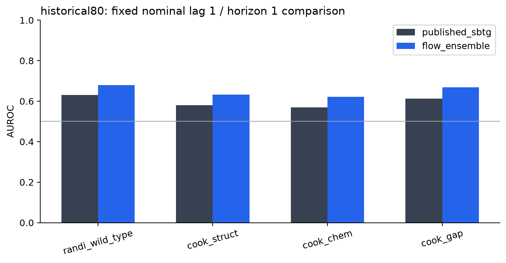

### Lag reliability

**57/80 sources** meet the fixed all-lag strong support/genealogy rule. Joint max-T yields **7554 effect cells** and **92 lag-contrast cells** at p ≤ .05. These are cells, not distinct edges or additional animals. Historical copied/pseudo-paired recording-row descriptions; not independent-animal inference. Lag changes also change the repair boundary and anchoring interval. The nominal source lag and forecast horizon are reported separately; no physical transmission delay is inferred.

| comparison       |   lag |   spearman |   rmse |   sign_agreement |
|:-----------------|------:|-----------:|-------:|-----------------:|
| generator_0_vs_1 |     1 |     0.6468 | 0.0346 |           0.7384 |
| generator_0_vs_2 |     1 |     0.6487 | 0.0337 |           0.7380 |
| generator_1_vs_2 |     1 |     0.6729 | 0.0330 |           0.7508 |
| independent_MC   |     1 |     0.9015 | 0.0178 |           0.8660 |
| direct_N4096     |     1 |     0.8754 | 0.0202 |           0.8388 |
| generator_0_vs_1 |     4 |     0.6872 | 0.0340 |           0.7460 |
| generator_0_vs_2 |     4 |     0.6990 | 0.0328 |           0.7566 |
| generator_1_vs_2 |     4 |     0.7184 | 0.0321 |           0.7729 |
| independent_MC   |     4 |     0.9208 | 0.0167 |           0.8764 |
| direct_N4096     |     4 |     0.8678 | 0.0224 |           0.8429 |
| generator_0_vs_1 |     8 |     0.7296 | 0.0343 |           0.7780 |
| generator_0_vs_2 |     8 |     0.7346 | 0.0331 |           0.7774 |
| generator_1_vs_2 |     8 |     0.7481 | 0.0327 |           0.7769 |
| independent_MC   |     8 |     0.9412 | 0.0153 |           0.8929 |
| direct_N4096     |     8 |     0.8711 | 0.0236 |           0.8547 |
| generator_0_vs_1 |    16 |     0.7498 | 0.0368 |           0.7864 |
| generator_0_vs_2 |    16 |     0.7450 | 0.0361 |           0.7854 |
| generator_1_vs_2 |    16 |     0.7604 | 0.0353 |           0.7949 |
| independent_MC   |    16 |     0.9562 | 0.0148 |           0.9163 |
| direct_N4096     |    16 |     0.8635 | 0.0278 |           0.8495 |

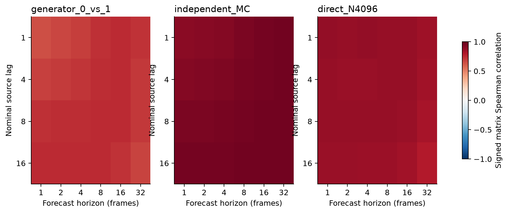
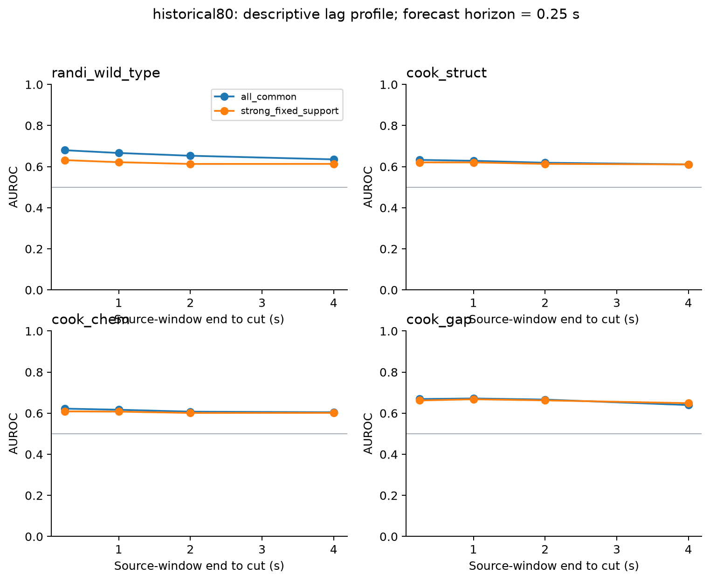
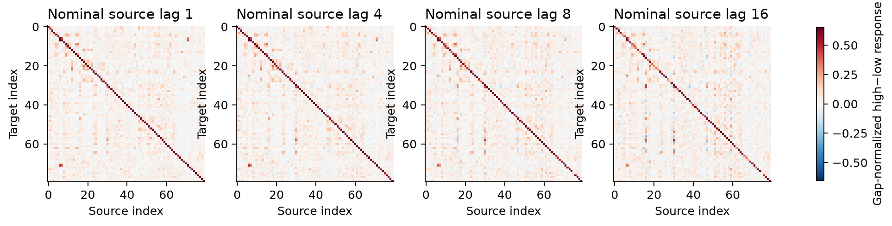
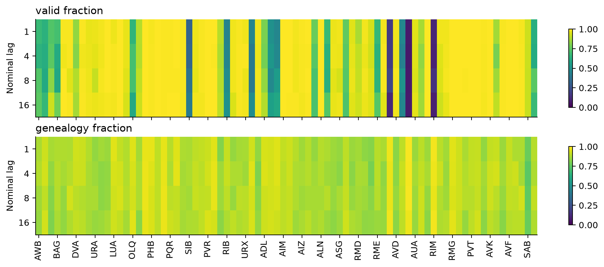

The endpoint-timing-matched comparisons use nominal flow lags 0/7 plus one forecast frame against published SBTG lags 1/8. See the separately labeled rows in `reference_deltas.csv`; equality of endpoint timing does not make a four-frame repaired-history contrast identical to the SBTG estimand.

The separate within-source label-permutation lag-maximum sensitivity corrects for choosing the largest reference AUROC over four lags and then adjusts its 16-panel family:

| channel               | context              | reference       |   best_nominal_lag |   max_auroc |   permutation_p |   holm_family_p | status    |
|:----------------------|:---------------------|:----------------|-------------------:|------------:|----------------:|----------------:|:----------|
| endpoint_mean         | state_average        | randi_wild_type |                  1 |      0.6318 |          0.0010 |          0.0110 | evaluated |
| endpoint_mean         | state_average        | cook_struct     |                  4 |      0.6208 |          0.0005 |          0.0080 | evaluated |
| endpoint_mean         | state_average        | cook_chem       |                  1 |      0.6089 |          0.0005 |          0.0080 | evaluated |
| endpoint_mean         | state_average        | cook_gap        |                  4 |      0.6679 |          0.0005 |          0.0080 | evaluated |
| endpoint_mean         | onset_minus_baseline | randi_wild_type |                  1 |      0.5681 |          0.1254 |          0.5847 | evaluated |
| endpoint_mean         | onset_minus_baseline | cook_struct     |                  4 |      0.5264 |          0.2749 |          0.6342 | evaluated |
| endpoint_mean         | onset_minus_baseline | cook_chem       |                  1 |      0.5263 |          0.4593 |          0.6342 | evaluated |
| endpoint_mean         | onset_minus_baseline | cook_gap        |                  4 |      0.5403 |          0.1169 |          0.5847 | evaluated |
| endpoint_wasserstein1 | state_average        | randi_wild_type |                  8 |      0.6581 |          0.0010 |          0.0110 | evaluated |
| endpoint_wasserstein1 | state_average        | cook_struct     |                  1 |      0.5775 |          0.0005 |          0.0080 | evaluated |
| endpoint_wasserstein1 | state_average        | cook_chem       |                  1 |      0.5795 |          0.0010 |          0.0110 | evaluated |
| endpoint_wasserstein1 | state_average        | cook_gap        |                  1 |      0.6117 |          0.0005 |          0.0080 | evaluated |
| endpoint_wasserstein1 | onset_minus_baseline | randi_wild_type |                  4 |      0.5887 |          0.2114 |          0.6342 | evaluated |
| endpoint_wasserstein1 | onset_minus_baseline | cook_struct     |                  1 |      0.5570 |          0.0240 |          0.1919 | evaluated |
| endpoint_wasserstein1 | onset_minus_baseline | cook_chem       |                  1 |      0.5656 |          0.0425 |          0.2549 | evaluated |
| endpoint_wasserstein1 | onset_minus_baseline | cook_gap        |                  1 |      0.5457 |          0.0275 |          0.1924 | evaluated |

### Factual prediction and sampler convergence

| method               |   horizon |   energy |   rmse |   coverage90 |
|:---------------------|----------:|---------:|-------:|-------------:|
| flow                 |         1 |   1.4923 | 0.2369 |       0.8756 |
| flow                 |         2 |   1.9297 | 0.3051 |       0.8706 |
| flow                 |         4 |   2.6678 | 0.4170 |       0.8517 |
| flow                 |         8 |   3.7720 | 0.5843 |       0.8189 |
| flow                 |        16 |   4.8874 | 0.7599 |       0.7897 |
| flow                 |        32 |   5.9739 | 0.9407 |       0.7846 |
| persistence_gaussian |         1 |   1.5579 | 0.2456 |       0.8698 |
| persistence_gaussian |         2 |   2.0192 | 0.3166 |       0.8836 |
| persistence_gaussian |         4 |   2.7640 | 0.4259 |       0.8898 |
| persistence_gaussian |         8 |   3.8567 | 0.5886 |       0.8850 |
| persistence_gaussian |        16 |   4.9918 | 0.7567 |       0.8852 |
| persistence_gaussian |        32 |   6.2640 | 0.9390 |       0.8882 |
| ridge_gaussian       |         1 |   1.5021 | 0.2361 |       0.8336 |
| ridge_gaussian       |         2 |   1.9079 | 0.2972 |       0.8120 |
| ridge_gaussian       |         4 |   2.5948 | 0.3971 |       0.7885 |
| ridge_gaussian       |         8 |   3.5936 | 0.5440 |       0.7638 |
| ridge_gaussian       |        16 |   4.5132 | 0.6857 |       0.7475 |
| ridge_gaussian       |        32 |   5.0445 | 0.7790 |       0.7470 |

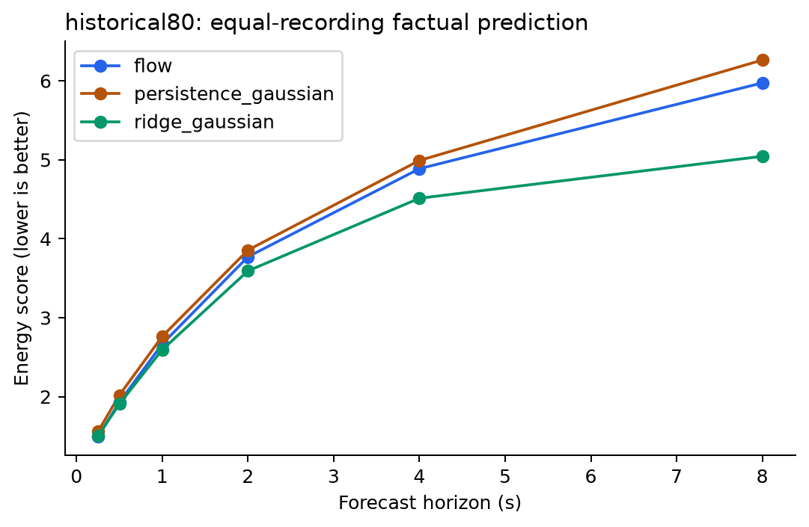
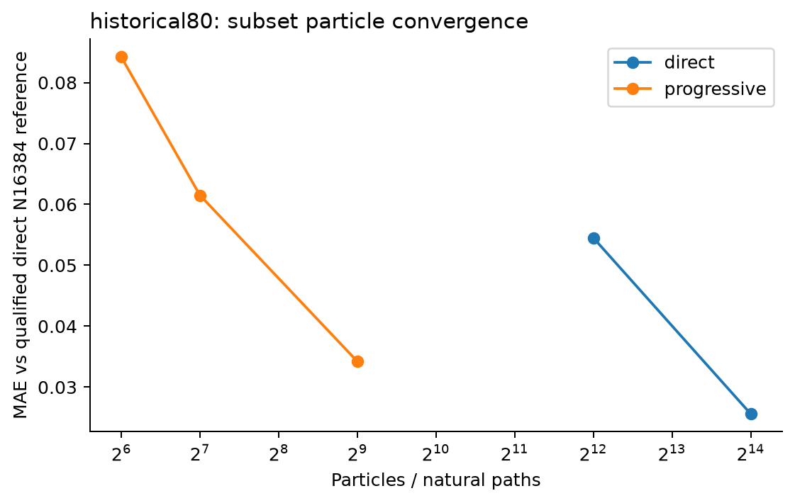

The particle figure uses only queries whose three independent N16384 direct runs all pass validity, have minimum ESS ≥ 12, and have normalized-response SD ≤ .05. The resolved-reference fractions, estimator validity, and unconditional differences are all retained in `particle_convergence.csv`. Unresolved direct references cannot adjudicate progressive SMC accuracy. `diagnostic_runs.csv` records actual transition/velocity evaluations and wall time; equal N is not equal computation.

### Derivative, zero-query and solver checks

`derivative_stability.csv` records means and MC standard deviations at full, half and quarter source separation. `diagnostic_cells.csv.gz` retains raw contrasts, requested gaps, achieved gaps and both normalizations. Small or reversed achieved gaps do not become valid derivatives through the historical .10 denominator floor. Fixed clamp bandwidth means this is at most a local sensitivity of a softened model-conditioned path law.

|   particles |   lag | phase    |   zero_query_raw_mse |   mean_achieved_gap |
|------------:|------:|:---------|---------------------:|--------------------:|
|          64 |     1 | baseline |               0.0000 |              0.0000 |
|          64 |     1 | onset    |               0.0000 |              0.0000 |
|          64 |     4 | baseline |               0.0000 |              0.0000 |
|          64 |     4 | onset    |               0.0000 |              0.0000 |
|         512 |     1 | baseline |               0.0000 |              0.0000 |
|         512 |     1 | onset    |               0.0000 |              0.0000 |
|         512 |     4 | baseline |               0.0000 |              0.0000 |
|         512 |     4 | onset    |               0.0000 |              0.0000 |

The equal-clamp negative control has exact raw contrast zero. Its nonzero raw MSE quantifies finite-particle arm noise. `solver_stability.csv` compares original and doubled flow integration steps with matched seeds. Neither diagnostic is evidence of biological causality.

## clean54

The ensemble exceeds published SBTG with a positive source-bootstrap simultaneous one-sided lower bound on **2 of four** primary reference panels. This is conditional reference correspondence, not proof of synapses or causal recovery. The complete per-seed and mask-specific comparisons remain in `analysis_stopped_20260916/clean54/reference_metrics.csv` and `reference_deltas.csv`.

| reference       |   delta_auroc |   delta_ci_low |   delta_ci_high |   simultaneous_one_sided_lower |   holm_bootstrap_tail_p |
|:----------------|--------------:|---------------:|----------------:|-------------------------------:|------------------------:|
| randi_wild_type |        0.0498 |        -0.0009 |          0.1009 |                        -0.0090 |                  0.0776 |
| cook_struct     |        0.0491 |         0.0230 |          0.0747 |                         0.0190 |                  0.0024 |
| cook_chem       |        0.0439 |         0.0180 |          0.0698 |                         0.0144 |                  0.0042 |
| cook_gap        |        0.0573 |         0.0024 |          0.1159 |                        -0.0045 |                  0.0776 |

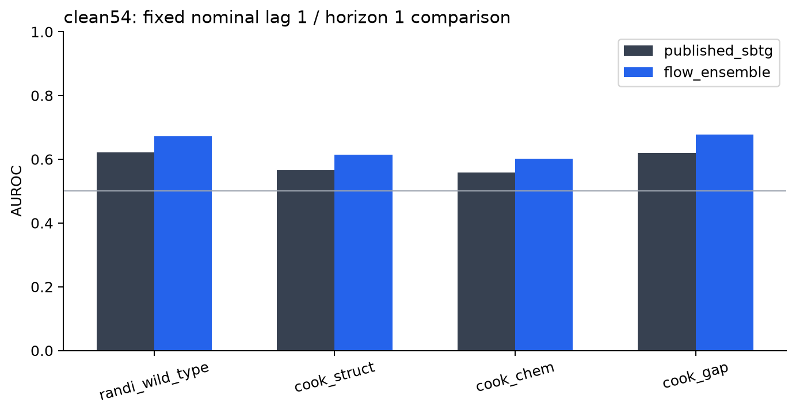

### Lag reliability

**33/54 sources** meet the fixed all-lag strong support/genealogy rule. Joint max-T yields **2242 effect cells** and **0 lag-contrast cells** at p ≤ .05. These are cells, not distinct edges or additional animals. Conditional recording sign-flip inference under joint symmetry; overlapping training fits and model/refit uncertainty remain. Lag changes also change the repair boundary and anchoring interval. The nominal source lag and forecast horizon are reported separately; no physical transmission delay is inferred.

| comparison       |   lag |   spearman |   rmse |   sign_agreement |
|:-----------------|------:|-----------:|-------:|-----------------:|
| generator_0_vs_1 |     1 |     0.5615 | 0.0431 |           0.7233 |
| generator_0_vs_2 |     1 |     0.5514 | 0.0452 |           0.7198 |
| generator_1_vs_2 |     1 |     0.5579 | 0.0446 |           0.7219 |
| independent_MC   |     1 |     0.9037 | 0.0200 |           0.8850 |
| direct_N4096     |     1 |     0.8690 | 0.0234 |           0.8613 |
| generator_0_vs_1 |     4 |     0.6259 | 0.0439 |           0.7352 |
| generator_0_vs_2 |     4 |     0.6409 | 0.0445 |           0.7610 |
| generator_1_vs_2 |     4 |     0.6299 | 0.0445 |           0.7519 |
| independent_MC   |     4 |     0.9206 | 0.0201 |           0.8840 |
| direct_N4096     |     4 |     0.8785 | 0.0255 |           0.8630 |
| generator_0_vs_1 |     8 |     0.6688 | 0.0456 |           0.7488 |
| generator_0_vs_2 |     8 |     0.6813 | 0.0462 |           0.7690 |
| generator_1_vs_2 |     8 |     0.6669 | 0.0458 |           0.7561 |
| independent_MC   |     8 |     0.9419 | 0.0191 |           0.9092 |
| direct_N4096     |     8 |     0.8873 | 0.0268 |           0.8697 |
| generator_0_vs_1 |    16 |     0.6968 | 0.0503 |           0.7739 |
| generator_0_vs_2 |    16 |     0.7153 | 0.0513 |           0.7844 |
| generator_1_vs_2 |    16 |     0.7147 | 0.0497 |           0.7813 |
| independent_MC   |    16 |     0.9566 | 0.0188 |           0.9193 |
| direct_N4096     |    16 |     0.8735 | 0.0327 |           0.8508 |

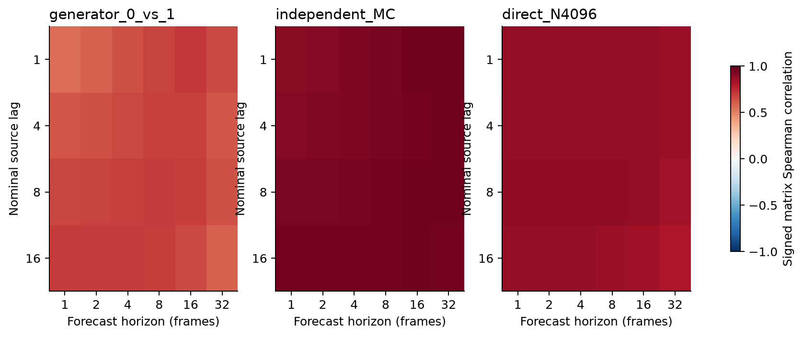
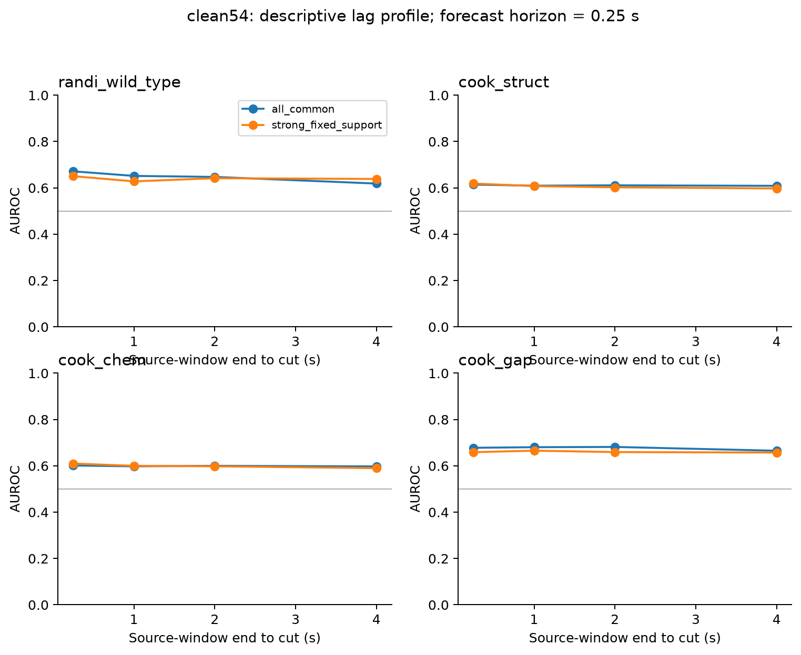
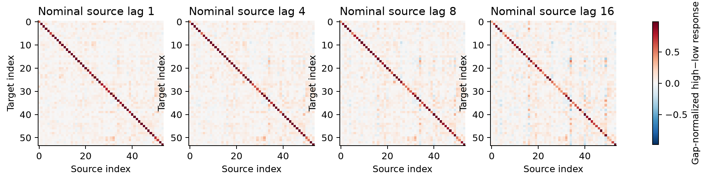
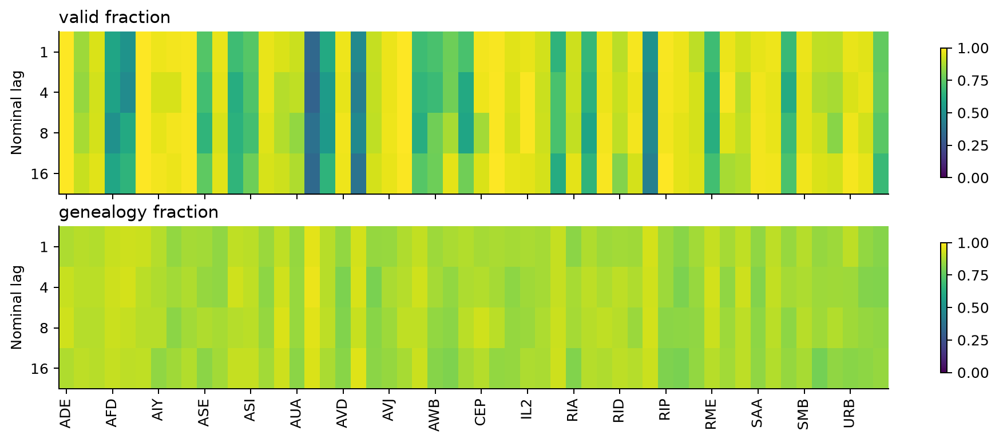

The endpoint-timing-matched comparisons use nominal flow lags 0/7 plus one forecast frame against published SBTG lags 1/8. See the separately labeled rows in `reference_deltas.csv`; equality of endpoint timing does not make a four-frame repaired-history contrast identical to the SBTG estimand.

The separate within-source label-permutation lag-maximum sensitivity corrects for choosing the largest reference AUROC over four lags and then adjusts its 16-panel family:

| channel               | context              | reference       |   best_nominal_lag |   max_auroc |   permutation_p |   holm_family_p | status    |
|:----------------------|:---------------------|:----------------|-------------------:|------------:|----------------:|----------------:|:----------|
| endpoint_mean         | state_average        | randi_wild_type |                  1 |      0.6505 |          0.0005 |          0.0080 | evaluated |
| endpoint_mean         | state_average        | cook_struct     |                  1 |      0.6187 |          0.0005 |          0.0080 | evaluated |
| endpoint_mean         | state_average        | cook_chem       |                  1 |      0.6099 |          0.0005 |          0.0080 | evaluated |
| endpoint_mean         | state_average        | cook_gap        |                  4 |      0.6655 |          0.0005 |          0.0080 | evaluated |
| endpoint_mean         | onset_minus_baseline | randi_wild_type |                 16 |      0.5793 |          0.0120 |          0.1199 | evaluated |
| endpoint_mean         | onset_minus_baseline | cook_struct     |                 16 |      0.5175 |          0.8801 |          1.0000 | evaluated |
| endpoint_mean         | onset_minus_baseline | cook_chem       |                 16 |      0.5149 |          0.9245 |          1.0000 | evaluated |
| endpoint_mean         | onset_minus_baseline | cook_gap        |                  4 |      0.5590 |          0.3028 |          1.0000 | evaluated |
| endpoint_wasserstein1 | state_average        | randi_wild_type |                  1 |      0.6879 |          0.0005 |          0.0080 | evaluated |
| endpoint_wasserstein1 | state_average        | cook_struct     |                  1 |      0.5515 |          0.0820 |          0.7376 | evaluated |
| endpoint_wasserstein1 | state_average        | cook_chem       |                  1 |      0.5421 |          0.2674 |          1.0000 | evaluated |
| endpoint_wasserstein1 | state_average        | cook_gap        |                  1 |      0.6068 |          0.0080 |          0.0880 | evaluated |
| endpoint_wasserstein1 | onset_minus_baseline | randi_wild_type |                  4 |      0.5839 |          0.0880 |          0.7376 | evaluated |
| endpoint_wasserstein1 | onset_minus_baseline | cook_struct     |                  8 |      0.5150 |          0.9965 |          1.0000 | evaluated |
| endpoint_wasserstein1 | onset_minus_baseline | cook_chem       |                  4 |      0.5175 |          0.9985 |          1.0000 | evaluated |
| endpoint_wasserstein1 | onset_minus_baseline | cook_gap        |                  8 |      0.5080 |          0.9190 |          1.0000 | evaluated |

### Factual prediction and sampler convergence

| method               |   horizon |   energy |   rmse |   coverage90 |
|:---------------------|----------:|---------:|-------:|-------------:|
| flow                 |         1 |   1.0508 | 0.2024 |       0.8777 |
| flow                 |         2 |   1.2983 | 0.2507 |       0.8794 |
| flow                 |         4 |   1.7097 | 0.3288 |       0.8673 |
| flow                 |         8 |   2.4360 | 0.4662 |       0.8306 |
| flow                 |        16 |   3.5611 | 0.6776 |       0.7813 |
| flow                 |        32 |   5.0319 | 0.9588 |       0.7541 |
| persistence_gaussian |         1 |   1.0980 | 0.2101 |       0.8675 |
| persistence_gaussian |         2 |   1.3495 | 0.2584 |       0.8927 |
| persistence_gaussian |         4 |   1.6937 | 0.3174 |       0.9071 |
| persistence_gaussian |         8 |   2.3015 | 0.4217 |       0.9052 |
| persistence_gaussian |        16 |   3.2360 | 0.5868 |       0.8920 |
| persistence_gaussian |        32 |   4.5022 | 0.8171 |       0.8797 |
| ridge_gaussian       |         1 |   1.2369 | 0.2337 |       0.7546 |
| ridge_gaussian       |         2 |   1.6037 | 0.2981 |       0.7028 |
| ridge_gaussian       |         4 |   2.1957 | 0.3986 |       0.6375 |
| ridge_gaussian       |         8 |   3.2549 | 0.5735 |       0.5599 |
| ridge_gaussian       |        16 |   4.6922 | 0.8079 |       0.4968 |
| ridge_gaussian       |        32 |   5.8608 | 1.0087 |       0.4949 |

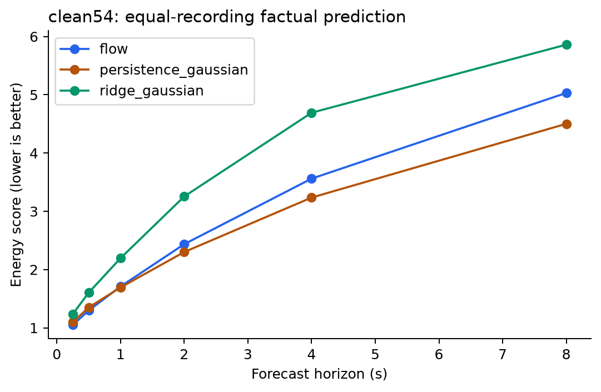
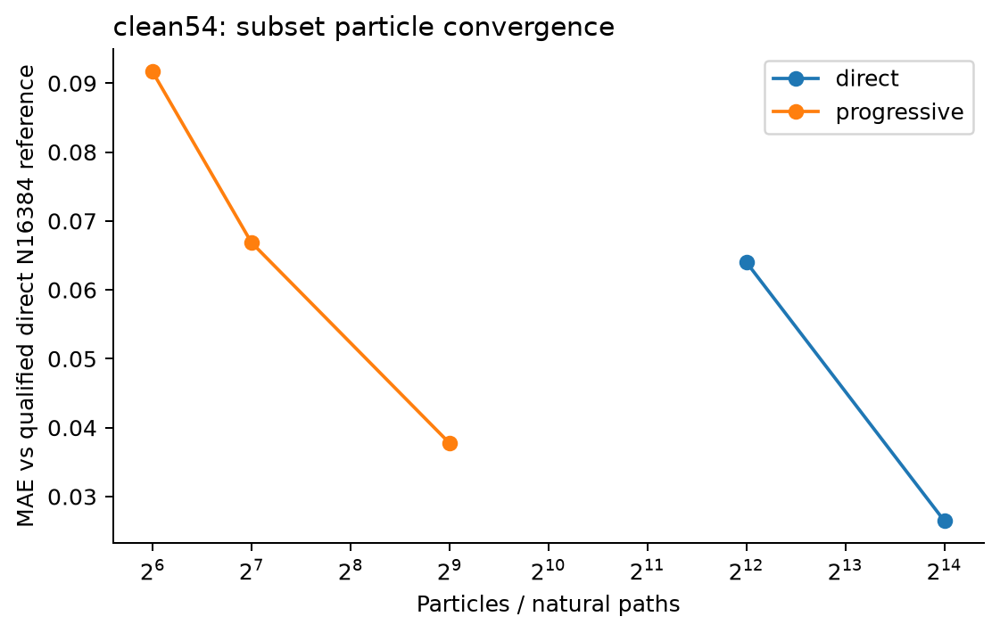

The particle figure uses only queries whose three independent N16384 direct runs all pass validity, have minimum ESS ≥ 12, and have normalized-response SD ≤ .05. The resolved-reference fractions, estimator validity, and unconditional differences are all retained in `particle_convergence.csv`. Unresolved direct references cannot adjudicate progressive SMC accuracy. `diagnostic_runs.csv` records actual transition/velocity evaluations and wall time; equal N is not equal computation.

### Derivative, zero-query and solver checks

`derivative_stability.csv` records means and MC standard deviations at full, half and quarter source separation. `diagnostic_cells.csv.gz` retains raw contrasts, requested gaps, achieved gaps and both normalizations. Small or reversed achieved gaps do not become valid derivatives through the historical .10 denominator floor. Fixed clamp bandwidth means this is at most a local sensitivity of a softened model-conditioned path law.

|   particles |   lag | phase    |   zero_query_raw_mse |   mean_achieved_gap |
|------------:|------:|:---------|---------------------:|--------------------:|
|          64 |     1 | baseline |               0.0000 |              0.0000 |
|          64 |     1 | onset    |               0.0000 |              0.0000 |
|          64 |     4 | baseline |               0.0000 |              0.0000 |
|          64 |     4 | onset    |               0.0000 |              0.0000 |
|         512 |     1 | baseline |               0.0000 |              0.0000 |
|         512 |     1 | onset    |               0.0000 |              0.0000 |
|         512 |     4 | baseline |               0.0000 |              0.0000 |
|         512 |     4 | onset    |               0.0000 |              0.0000 |

The equal-clamp negative control has exact raw contrast zero. Its nonzero raw MSE quantifies finite-particle arm noise. `solver_stability.csv` compares original and doubled flow integration steps with matched seeds. Neither diagnostic is evidence of biological causality.

## Scope and reproducibility

- Read `PROTOCOL.md` and `ANALYSIS_IMPLEMENTATION.md` for the prespecified decisions and exact estimands.
- `snapshot_manifest.json` binds copied source and inputs. `execution_manifest.json` binds primary fitting/sampling workers. Per-fit and per-archive receipts enforce checkpoint and configuration identity.
- `analysis_stopped_20260916/frozen_sampling.json` seals raw matrices before external scoring. All numerical results and source/reference masks are inspectable.
- Historical 80-class head/tail pseudo-pairing and donor copying are preserved solely for comparator compatibility; source-block or recording-row intervals do not undo those dependencies.
- Model-seed/Monte Carlo repeats are not independent animals. Conditional sign-flip inference does not incorporate complete refitting/selection uncertainty.
- Source histories span four frames and lagged repairs alter their boundary. A reliable conditional response matrix is still not an anatomical, receptor-specific or physical-delay matrix.
- Strong claims require prospective independent recordings and targeted interventions.

Atlas sources: [Cook et al. (2019)](https://www.nature.com/articles/s41586-019-1352-7), [Randi et al. (2023)](https://www.nature.com/articles/s41586-023-06683-4). Published SBTG inputs and the original source lineage are preserved in `inputs/published_sbtg/`.
