# What the assembled evidence supports

The new publication analysis is a read-only synthesis of the stopped NeuroPAL
study plus a separately labeled four-neuron tutorial. It does not retrain NeuroPAL,
replace failed results, or turn selected examples into new confirmatory tests.

## Old SBTG versus flow/progressive SMC

At nominal lag 1 and horizon 1, the fresh flow ensemble improves all four AUROC
point estimates in both cohorts. Cook structural and chemical improvements survive
the tested strong-source and endpoint-timing sensitivities. Clean54 Randi and gap
comparisons are unresolved under the simultaneous primary comparison; clean gap
average precision is slightly lower for flow. Scoring uses absolute effects and
common off-diagonal masks, so this evaluates ranking rather than sign accuracy.

| Cohort | Reference | Fresh flow AUROC | Published SBTG AUROC |
|---|---|---:|---:|
| clean54 | Randi | .6715 | .6217 |
| clean54 | Cook structural | .6142 | .5651 |
| clean54 | Cook chemical | .6015 | .5576 |
| clean54 | Cook gap | .6780 | .6207 |
| historical80 | Randi | .6800 | .6302 |
| historical80 | Cook structural | .6329 | .5807 |
| historical80 | Cook chemical | .6222 | .5698 |
| historical80 | Cook gap | .6689 | .6133 |

All 16 AUROC/AP comparisons were independently recomputed from packaged matrices,
with name alignment, masks and edge counts checked. The source-column bootstrap
holds fitted matrices fixed; it is not total uncertainty from animal sampling,
model selection and refitting. Figures show ordinary 95% intervals for differences;
the tables retain simultaneous one-sided lower bounds.

The initial historical80 flow attempt was below SBTG. Longer training recovered
higher point scores, and the fresh replication again produced higher scores.
This does not cure the historical input's pseudo-pairing and donor copying.
Older outcomes are retained as reported values, because their raw run directory
was absent. No combined significance test is made across those different protocols.

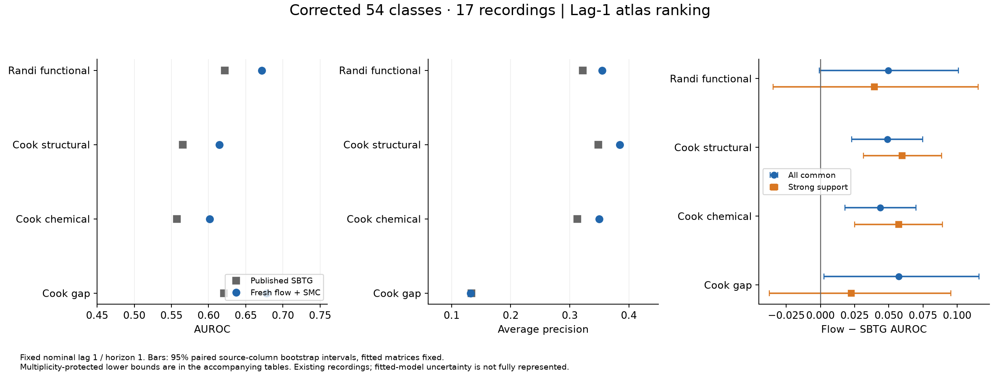
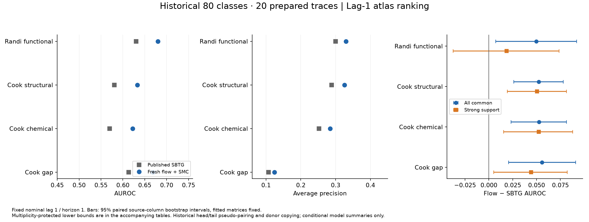

## Feasibility is dominated by repeated conditional sampling

The primary fresh training receipts sum to about **0.49 worker-hours for clean54**
and **0.13 for historical80**. The 60 primary sampling archives per cohort sum to
**33.53 and 24.94 worker-hours**, respectively. These are sums of recorded worker
durations on the study machine, not calendar runtime or a hardware-normalized cost.
They exclude diagnostics and incomplete extensions. Historical80 used eight-frame
model histories; clean54 used 80, so dimensionality alone does not explain cost.

A flow transition needs repeated velocity-network evaluations, and repaired queries
repeat those transitions for sources, lags, phases and particle branches. Direct
sampling can share a natural path bank across sources; progressive SMC improves
support but incurs query-specific branching and resampling. Equal particle count
therefore is not equal work. No matched fresh SBTG timing experiment exists here,
so the repository does not report an invented SBTG speedup or slowdown ratio.


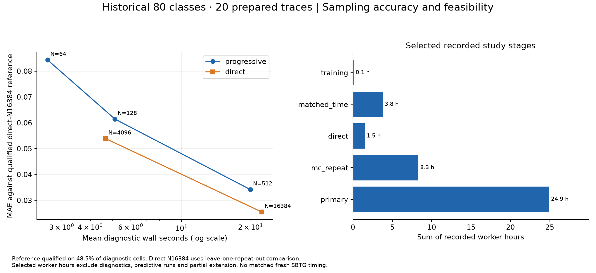

The original corrected54 four-sampler study favored progressive at N32 for support
and atlas ranking, but its reported runtime was much greater than direct N32.
The fresh qualified-reference checks show decreasing error from progressive N64
to N512 in both cohorts. Only 41.8% of clean and 48.5% of historical diagnostic
cells have a resolved high-particle reference, limiting that conclusion's coverage.

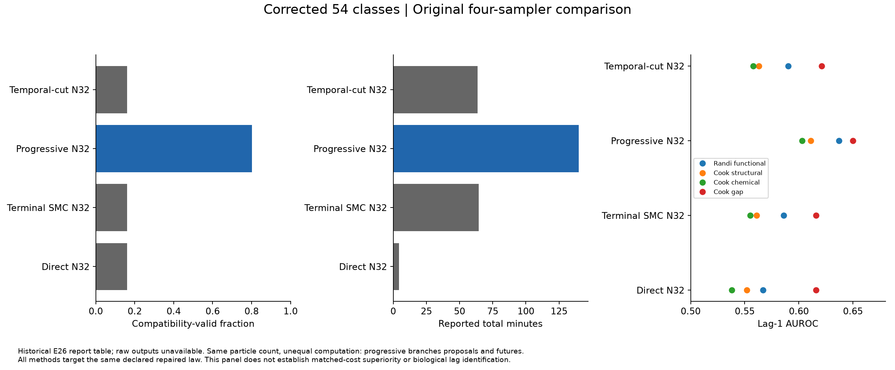

## Generator choice: predictive fit does not certify effects

The original 16-candidate screen is retained separately from corrected54 and the
fresh study. The corrected model report favors flow's predictive energy, while
its dependence-shuffling experiment shows that this advantage is largely preserved
without the fitted cross-neuron sample dependence. It cannot certify effect accuracy.
There is no complete comparable saved 80-neuron GP/Transformer lag tournament.

The separate nine-generator benchmark uses four known laws and three independently
generated datasets per law. Neural initialization seeds are averaged within each
dataset before comparison. In the central linear Gaussian example, diagonal and
correlated neural Gaussian predictive energy differed by about 1.2%, while their
conditional-effect errors differed approximately nineteenfold. A full-covariance
ridge model performed well on that linear law. No generator wins every law/query.

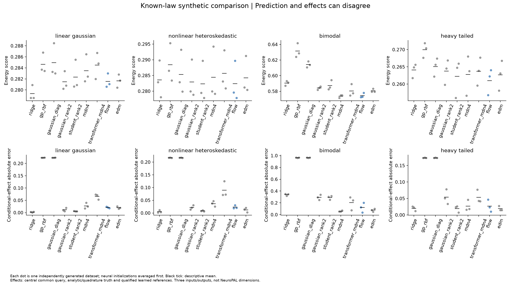
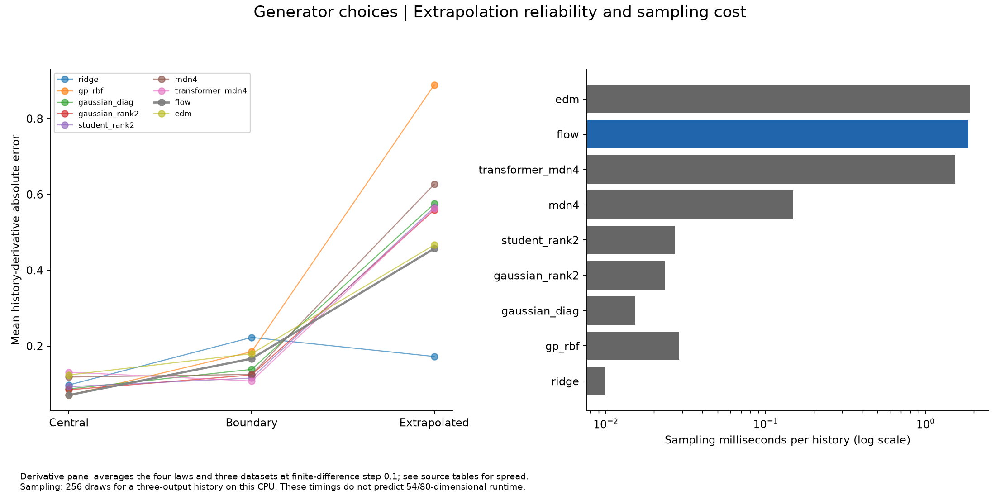

## Fresh robustness

Independent MC matrices correlate around .90, but training-seed correlations are
about .55–.56 for clean54 and .65–.67 for historical80. Smaller contrasts have larger
normalized-response MC variation; convergence to a derivative is not established.
All 15 clean primary fits reached their epoch cap. The incomplete longer-training
extension is excluded rather than mixed into the primary ensemble.

Strong-source masks retain 33/54 and 57/80 sources. Strict complete-case aggregation
retains zero clean source columns and 12 historical ones. Zero complete-case
coverage is not a zero-effect result and does not mean every episode failed.

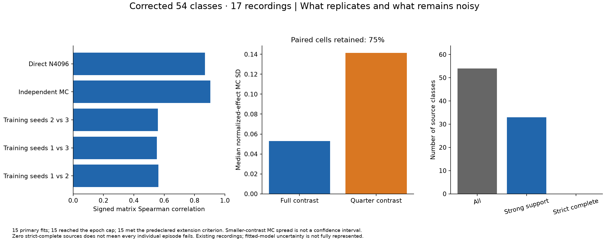
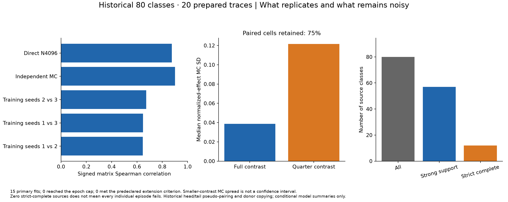

## Neuron-level effects and distinct lag notions

The full corrected test family and a pair-level descriptive summary are supplied
for each cohort. The illustration rule is fixed in `analysis/build_inputs.py`:
choose the six largest absolute baseline endpoint-mean estimates among corrected
p≤.05 cells at **lag1/horizon1**. This is a post-hoc illustration, not a new test.

For clean54, those pairs are URA→OLQ, URB→RIP, FLP→ADE, IL1→URB, OLL→RIP and URA→IL1.
They show supported baseline model responses; they do not identify anatomical or
causal connections. The historical examples are DVA→DVB, DVB→DVA, DVB→DVC, DVC→DVB,
LUA→PVC and PHB→PLN. They are tail-class pairs in the compromised historical lineage;
their apparent strength cannot establish biological replication.

At fixed lag1/h1 there are 83 clean and 237 historical corrected baseline-mean cells.
Across the entire lag/horizon grid, there are 2,242 clean and 7,554 historical
baseline-mean cells. **Clean54 has zero corrected lag-minus-1 cells.** Historical80
has 92, conditional on its problematic prepared traces. Both cohorts have no
corrected onset-minus-baseline discoveries in the registered families.

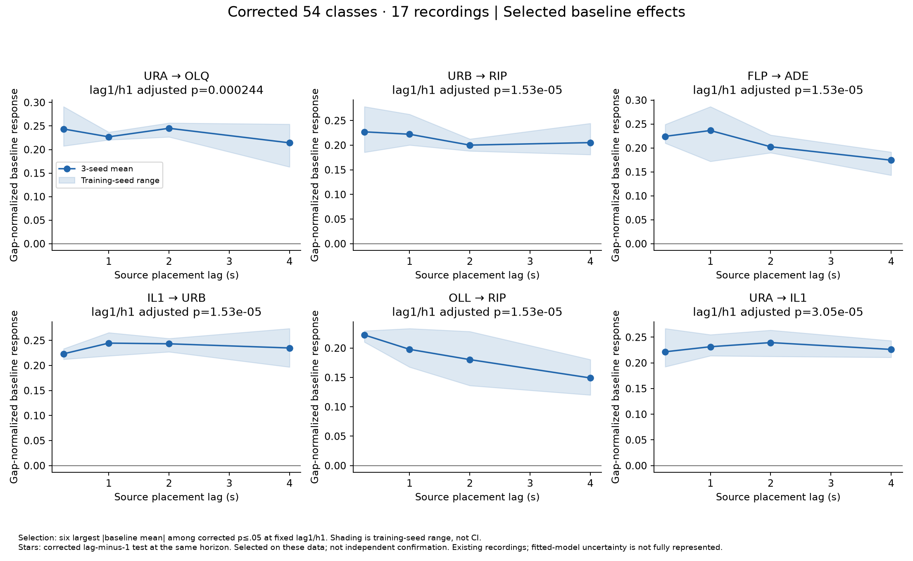
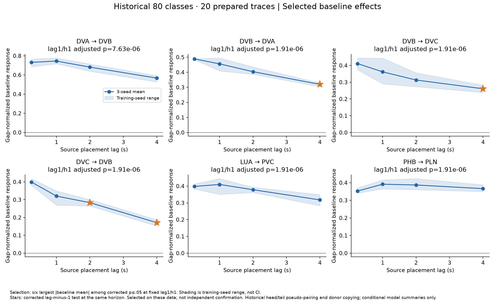
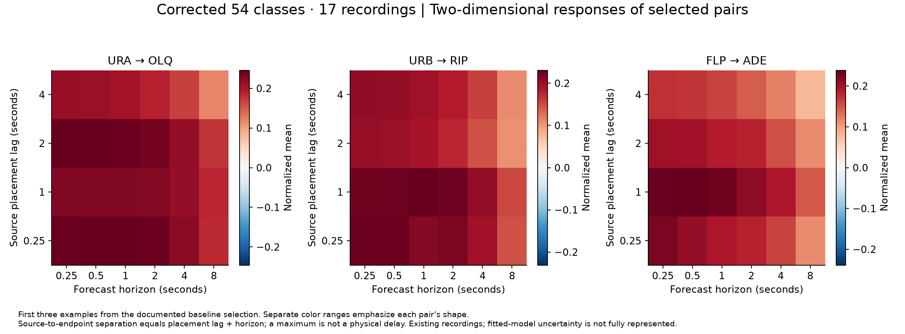
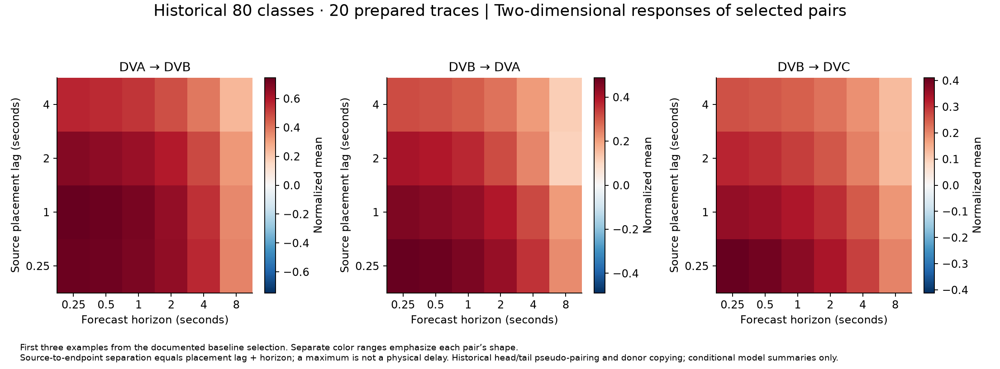

A source placement lag specifies how far before the forecast cut the source window
ends. Forecast horizon specifies how far beyond that cut we predict. Their sum is
source-to-endpoint separation. The maximum on this two-dimensional surface is not
an identified transmission delay. Shaded profile bands are the range over three
training-seed means, not confidence intervals. Historical p-values do not repair
recording dependence; all inference also conditions on the fitted models.

## Four-neuron tutorial

The [executed notebook](../notebooks/four_neuron_tutorial.ipynb) gives explicit
nonlinear equations with noisy one-, two- and three-frame effects. It trains the
archived flow-matching head on 16 independent recordings, validates on four and
checks predictions on four more. It then uses the actual archived direct and
progressive samplers with the known-law and learned-flow adapters.

The notebook checks all 48 analytic Jacobian entries against finite differences,
contrasts the repaired response with a known simulator intervention, and plots both
time axes. It saves its simulated data, checkpoint, estimates and figures. This is
a single-fit, single-anchor intuition exercise, not a new broad benchmark.

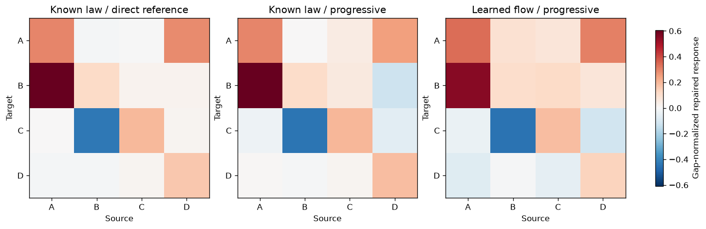

## Reproduce the new analysis

A normal Git clone includes the compact verified figure inputs and notebook source:

```bash
python -m pip install -r requirements.txt
python analysis/make_figures.py
python tools/run_notebook.py
python -m pytest tests -q
```

To rederive compact inputs from the frozen full artifacts, restore the data release
first, then run `python analysis/make_figures.py --refresh-data`. The figure catalog
contains captions and source-table identifiers. CSVs retain exact values, and every
figure is exported as PNG and vector PDF. Historical report-only rows are labeled.
